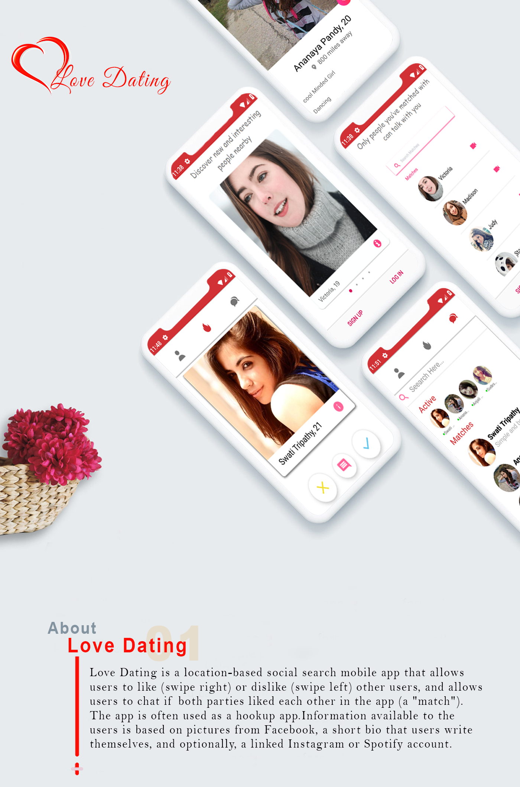
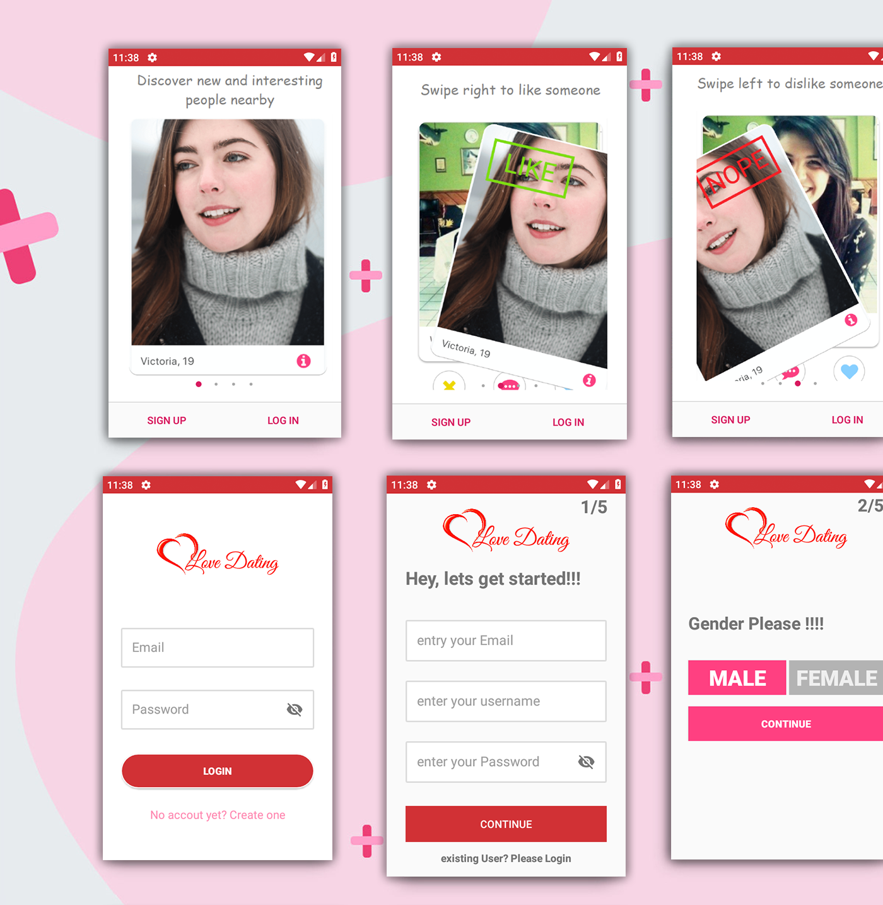
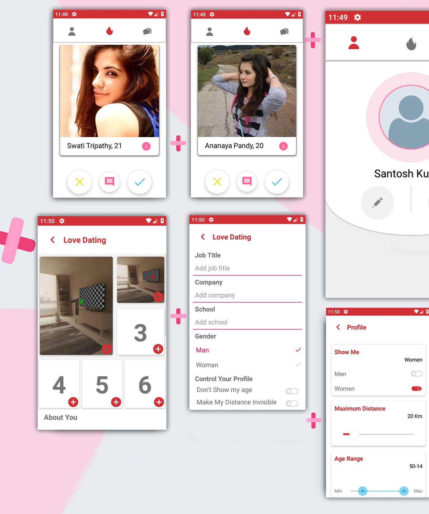
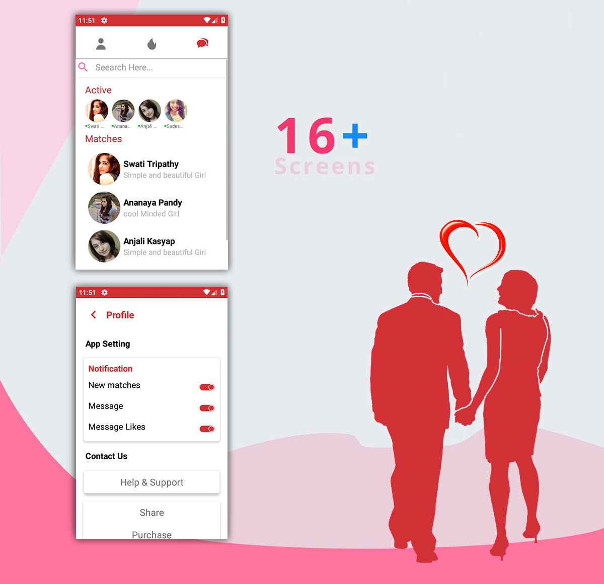

# Dating App
Welcome to the Dating App project! This application aims to connect individuals looking for romantic relationships or companionship. Built using Java, this dating app provides a platform for users to create profiles, browse potential matches, chat with others, and potentially find meaningful connections.

## Features
1. **User Registration:** Allows users to sign up and create personalized profiles with details such as age, gender, interests, and photos.

2. **Matching Algorithm:** Implements a matching algorithm to suggest potential matches based on compatibility scores, interests, and preferences.

3. **Profile Browsing:** Enables users to browse profiles of other users, view photos, and read bio descriptions to learn more about potential matches.

4. **Chat Messaging:** Provides a messaging feature for users to communicate with their matches, exchange messages, and build connections.

5. **Privacy and Security:** Ensures user privacy and data security by implementing encryption, authentication, and privacy settings.

6. **Notifications:** Sends notifications to users for new matches, messages, profile views, and other relevant activities.

## Installation
To run the Dating App locally, follow these steps:

1. **Clone the Repository:** Clone the repository to your local machine using the following command:

git clone https://github.com/RadinaAvramova/DatingApp.git

2. **Navigate to the Directory:** Change your current directory to the location of the cloned repository:

cd DatingApp

3. **Set Up Dependencies:** Ensure that you have Java installed on your machine. Additionally, configure any required dependencies specified in the project documentation or README file.

4. **Run the Application:** Use the appropriate command or script to start the Dating App application locally.

5. **Access the Application:** Once the application is running, access it through a web browser or mobile device to begin creating profiles and browsing potential matches.

## Usage
1. **User Registration:** Sign up and create a profile by providing personal details and preferences.

2. **Profile Creation:** Customize your profile by adding photos, writing bio descriptions, and specifying interests.

3. **Browse Matches:** Explore profiles of other users and view compatibility scores to find potential matches.

4. **Initiate Communication:** Start conversations with matches by sending messages and expressing interest.

5. **Manage Connections:** Keep track of your matches, conversations, and interactions within the app.

## Customization
You can customize the Dating App by modifying aspects such as the matching algorithm, user profile fields, messaging features, and privacy settings. Additionally, you can enhance the user interface, add new functionalities, or integrate with social media platforms for expanded networking opportunities.

</img> 

</img>  
</img>  
</img>  
</img>  

